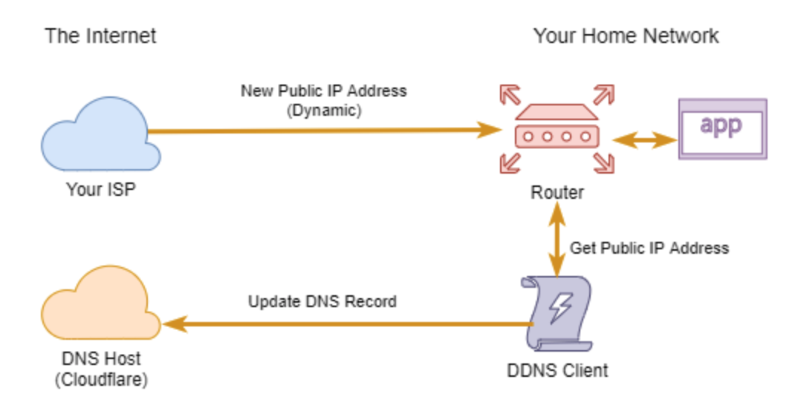

A dynamic DNS records manage program by using Cloudflare API.

---

English | [中文](./README_cn.md)

# What is Cloudflare Dynamic DNS?

DNS records are inherently static, and it does not play well with dynamic IP addresses. Now, to solve that problem, you’ll need to set up dynamic DNS. Fortunately, Cloudflare provides an API that allows you to manage DNS records programmatically.

To set up a Cloudflare dynamic DNS, you’ll need to run a process on a client inside your network that does two main actions: get your network’s current public IP address and automatically update the corresponding DNS record.

The image below shows the high-level diagram of how the Cloudflare dynamic DNS update flow happens.



# Prerequisites

- You own a domain name.
- You own a cloudflare account. A free account is enough.
- [You must have already added your domain to Cloudflare.](https://community.cloudflare.com/t/step-1-adding-your-domain-to-cloudflare/64309)
- [You must have already added a DNS record under your domain in Cloudflare.](https://support.cloudflare.com/hc/en-us/articles/360019093151-Managing-DNS-records-in-Cloudflare#h_60566325041543261564371)
- Getting the Cloudflare API Token.

# Usage

``` bash
./ddns-cloudflare run --conf /yourfolder/config.json
```

You can schedule a cron job in Linux.
```
*/15 * * * * ~/ddns-cloudflare run > ~/cf_ddns.log
```